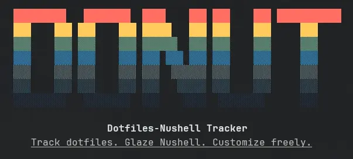

# 🍩 DoNuT (Dotfiles-Nushell Tracker)

<div align="center"></div>

This is my personal repository for managing the installation and
configuration of all the applications I use and their related
configuration files.

Even if it is likely of little use to others, I am writing the details
here anyway as a personal reminder for future updates.

## Table of Contents

- [Getting Started](#-getting-started)
- [Terminology](#-terminology)
- [The Script](#-the-script)
    - [The Database](#the-database)
    - [The Glazes](#the-glazes)
    - [Data and Statistics](#data-and-statistics)
- [Technical Details](#-technical-details)
    - [Directory Structure](#directory-structure)
    - [Scripts and Support Library](#scripts-and-support-library)
- [TODOs](#todos)

## ❓ Why another tricky dotfiles manager?

Why another tricky (not really) dotfiles manager when there are already
so many great options like
[Ansible](https://github.com/ansible/ansible),
[Chezmoi](https://github.com/twpayne/chezmoi),
[Yadm](https://github.com/yadm-dev/yadm),
[Dotter](https://github.com/SuperCuber/dotter), or
[Stow](https://www.gnu.org/software/stow/)?

Well, aren’t we programmers? Where’s the fun if we can’t reinvent the
wheel according to our needs for the sole purpose of getting our hands
dirty? 😀

So let’s start baking!

## 🚀 Getting Started

The setup script is designed for my dual-environment workflow:
**Windows** (🤢) and **Arch Linux** via **WSL**. Since **Nushell** is my
shell of choice for both, the entire system is built around it. With
some minor changes, it should works on a bare Linux distro too.

### Requirements

These are the requirements to run the setup script:

- (Win) [Windows Subsystem for
  Linux](https://learn.microsoft.com/en-us/windows/wsl/install)
- (Win) [Arch Linux WSL](https://archlinux.org/download/)
- (Win/Lin) [Nushell](https://www.nushell.sh/book/installation.html) as
  the user’s default shell
- (Win/Lin) [Git](https://git-scm.com/install/) (base configuration; it
  will be further configured by the script)
- (Lin) [sudo](https://www.sudo.ws/)
- (Lin) [doas](https://github.com/Duncaen/OpenDoas) (optional, but it
  takes precedence over `sudo` if installed)

If you are the only user on the system, something like this should work
just fine:

```sh
# For sudo
echo "your_user_name ALL=(ALL:ALL) ALL" | sudo tee /etc/sudoers.d/your_user_name > /dev/null

# For doas
echo "permit persist setenv {PATH=/usr/local/bin:/usr/local/sbin:/usr/bin:/usr/sbin} your_user_name" | sudo tee -a /etc/doas.conf > /dev/null
```

### Installing

Clone the repository and fire up the engine:

```sh
git clone https://github.com/Ragnarokkr/dotfiles.git
./donut
```

### The Setup Workflow

The procedure is divided into **two phases** comprising **seven steps**:

- **Phase 1**: Preinstall and preconfig
    - **Check**: Verifies that minimum requirements are met.
    - **Preinstall**: Installs essential system-wide tools (e.g., `paru`,
      `unzip`).
    - **Preconfig**: Initial configuration for the preinstalled tools.
    - **Restart**: A mandatory pause. Shells or OS restarts ensure new
      binaries and environment variables are recognized.
- **Phase 2**: Install and config
    - **Install**: Installs everything marked for general installation.
    - **Config**: Applies the personalized configuration files.
    - **Second Restart**: The final _bake_. Ensures all changes are active
      and stable.

> [!TIP]
> You will be prompted for your user password (for `sudo`/`doas`)
> and occasionally for credentials (e.g., `Bitwarden` or `Age` encryption
> keys).

## 🗒 Terminology

This system uses **donuts** as a central metaphor. Why donuts? Well, who
doesn’t love donuts! I mean, even many famous Blender 3D artists started
with the well known [donut
tutorial](https://www.youtube.com/playlist?list=PLjEaoINr3zgGUwGwXlj9kBe7TrVWNjkyv)!

- **Glaze**: A Nushell script located in the `glazes/` directory. It
  manages a module’s manifest, installation, and configuration. It is
  the core logic provided by the user.
- **Topping**: An individual program installed by a Glaze. A Glaze
  generally includes one Topping for custom installation or
  configuration. When no specific setup is required, multiple Toppings
  can be logically grouped (e.g., a “cli-tools” glaze might contain
  several command-line programs).

## 🖥 The Script

The heart of the system is [donut](donut). It handles the heavy lifting,
from initial setup to database management.

```txt
Dotfiles-Nushell Tracker
Track dotfiles. Glaze Nushell. Customize freely.

Usage:
  > donut

Subcommands:
  donut db (custom) - Performs operations on the database
  donut glaze (custom) - Performs operations on glazes
  donut show (custom) - Show information about database or glazes

Flags:
  -h, --help: Display the help message for this command
```

### The Database

The system utilizes an SQLite database to track glazes, toppings, and
environmental state.

```txt
Performs operations on the database

Usage:
  > donut db {flags}

Flags:
  -h, --help: Display the help message for this command
  -c, --security-clean: Cleans sensitive environment settings from database
  -u, --update: Initializes/Updates the database
```

The `--security-clean` flag prevents sensitive data, like API keys, from
leaking if cached in the database during sync.

Use the `--update` flag whenever a glaze is added, updated, deleted, or
when related files are modified.

### The Glazes

Glazes serve as building blocks. To avoid repetition, the script
automates their creation and management.

```sh
Usage:
  > donut glaze {flags} (glaze)

Flags:
  -h, --help: Display the help message for this command
  -a, --add: Adds a new glaze module
  -d, --delete: Deletes an existing glaze module and its associated directories
  -r, --reset: Resets one or all glazes to their initial state

Parameters:
  glaze <string>: Glaze's unique name (optional)
```

The `--add` flag creates a new glaze in the `glazes/` directory.
Additional files must be manually created in a directory matching the
glaze’s name, located within the relevant scope directory (`common`,
`linux`, or `windows`).

> [!TIP]
> All glaze files are generated from [scripts/glaze.tmpl.nu](scripts/glaze.tmpl.nu).

The `--delete` flag removes an existing glaze and its related
directories from the file system.

> [!WARNING]
> All glaze files will be deleted. Ensure backups are made if needed!

The `--reset` flag restores a registered glaze to its initial state for
re-execution.

> [!NOTE]
> If no glaze name is provided, all glazes will be reset.

### Data and Statistics

View dotfile collection statistics.

```sh
Show information about database or glazes

Usage:
  > donut show {flags} (glaze)

Flags:
  -h, --help: Display the help message for this command
  -i, --info: Shows information about a glaze
  -l, --list: Shows a list of all registered glazes
  -s, --stats: Shows database's overall statistics

Parameters:
  glaze <string>: glaze's unique name (optional)
```

The `--info` flag lets you peek at the ingredients of a specific glaze.
If you don’t specify one, we’ll serve up a menu of every registered
glaze so you can pick your favorite to inspect.

```sh
> ./donut show --info age
╭──────────────┬──────────────────────────────────────────────────────────────────────────────────────────╮
│ name         │ age                                                                                      │
│ category     │ security                                                                                 │
│              │ ╭───┬───────────╮                                                                        │
│ dependencies │ │ 0 │ bitwarden │                                                                        │
│              │ ╰───┴───────────╯                                                                        │
│ description  │ A simple, secure, and modern encryption tool.                                            │
│ hook         │ install                                                                                  │
│              │ ╭───┬─────────────────┬────────────────────────────────────┬─────────┬─────────────────╮ │
│ toppings     │ │ # │      name       │                url                 │   os    │ package_manager │ │
│              │ ├───┼─────────────────┼────────────────────────────────────┼─────────┼─────────────────┤ │
│              │ │ 0 │ age             │ https://github.com/FiloSottile/age │ linux   │ pacman          │ │
│              │ │ 1 │ FiloSottile.age │ https://github.com/FiloSottile/age │ windows │ winget          │ │
│              │ ╰───┴─────────────────┴────────────────────────────────────┴─────────┴─────────────────╯ │
│ priority     │ 1                                                                                        │
│ scope        │ common                                                                                   │
╰──────────────┴──────────────────────────────────────────────────────────────────────────────────────────╯
```

The `--list` flag serves up a full menu of every glaze currently
registered in the DoNuT database.

```sh
> ./donut show --list
╭────┬──────────────────┬───────────────────────────────────────────────────────────────────────────────────────────────────────────────────────────────╮
│  # │       name       │                                                          description                                                          │
├────┼──────────────────┼───────────────────────────────────────────────────────────────────────────────────────────────────────────────────────────────┤
│  1 │ age              │ A simple, secure, and modern encryption tool.                                                                                 │
│  2 │ archivers        │ Various high performant archivers.                                                                                            │
:    :                  :                                                                                                                               :
│ 49 │ zellij           │ A terminal multiplexer.                                                                                                       │
│ 50 │ zoxide           │ A smarter cd command. Supports all major shells.                                                                              │
├────┼──────────────────┼───────────────────────────────────────────────────────────────────────────────────────────────────────────────────────────────┤
│  # │       name       │                                                          description                                                          │
╰────┴──────────────────┴───────────────────────────────────────────────────────────────────────────────────────────────────────────────────────────────╯
```

If you want to see the _nutrition facts_ of your setup, the `--stats`
flag serves up the overall totals for your glazes and toppings.

```sh
./donut show --stats
╭───────────────────────┬──────────────╮
│ Last Session          │ 18 hours ago │
│ Registered Glazes     │ 50           │
│ Registered Categories │ 10           │
│ Tracked Files         │ 125          │
│ Environment Settings  │ 12           │
│ Common Scoped         │ 21           │
│ Linux Scoped          │ 17           │
│ Windows Scoped        │ 10           │
│ Disabled              │ 2            │
╰───────────────────────┴──────────────╯
```

## 🔧 Technical Details

This section covers project implementation and customization.

### Directory Structure

    .
    ├── common              # configuration files common to all systems
    │   ├── age
    │   │   └── nushell
    │   ├── bitwarden
    │   │   └── nushell
    :   :
    ├── docs                # README documentation sources
    ├── glazes              # installation/configuration glazes
    ├── linux               # configuration files for Linux environment
    │   ├── btop
    │   ├── bun
    │   │   └── nushell
    :   :
    ├── scripts             # support scripts
    └── windows             # configuration files for Windows environment
        ├── cursors
        ├── nushell
        │   └── autoload
        ├── oh-my-posh
        │   └── nushell
    :   :

To ensure compatibility with the automation logic, please maintain the
default directory structure. Of course, if you’re a rebel who needs a
custom layout, you can redefine the paths in
[scripts/config.nu](scripts/config.nu).

You have full creative freedom over the contents of the glaze’s
directory under `common/`, `linux/`, and `windows/` directories. That
said, following the convention of placing Nushell files (`commands.nu`,
`aliases.nu`, `env.nu`, etc.) inside a dedicated `nushell/` subdirectory
will make your Glazes much easier to manage.

The `docs/` directory contains the Typst source used to generate this
documentation. To produce the GFM Markdown version, use
[Pandoc](https://pandoc.org/):

```sh
pandoc -f typst -t gfm -o README.md docs/README.typ
```

The `scripts/` directory houses the core logic and support libraries
required by `donut` and individual glazes. It also includes the `sql/`
folder, which contains the schemas used to build the application’s
database.

The `glazes/` folder hosts only the scripts of the registered glazes.

### Scripts and Support Library

Under the hood, `donut` is powered by a collection of specialized
scripts and libraries stored in `scripts/` and `scripts/libs/`.

| **Script**                | **Description**                                                     |
| ------------------------- | ------------------------------------------------------------------- |
| `scripts/config.nu`       | provides application-wide configuration data                        |
| `scripts/database.nu`     | provides utility commands to interact with the application database |
| `scripts/glaze.nu`        | provides utility commands to work with the glazes                   |
| `scripts/messages.nu`     | provides application-wide messages                                  |
| `scripts/libs/archive.nu` | provides utility commands to work with compressed archives          |
| `scripts/libs/fs.nu`      | provides utility commands to work with the file-system              |
| `scripts/libs/log.nu`     | provides a rudimentary logging system for the application           |
| `scripts/libs/net.nu`     | provides utility commands to access the network                     |
| `scripts/libs/strings.nu` | provides utility commands to work with strings                      |
| `scripts/libs/system.nu`  | provides utility commands to interact with the host system          |

## TODOs

- [ ] Implement a `clean` command for glazes to remove associated
      files and configurations from the system.

- [ ] Implement a `sync` command for glazes to synchronize files
      between the system and the repository.
